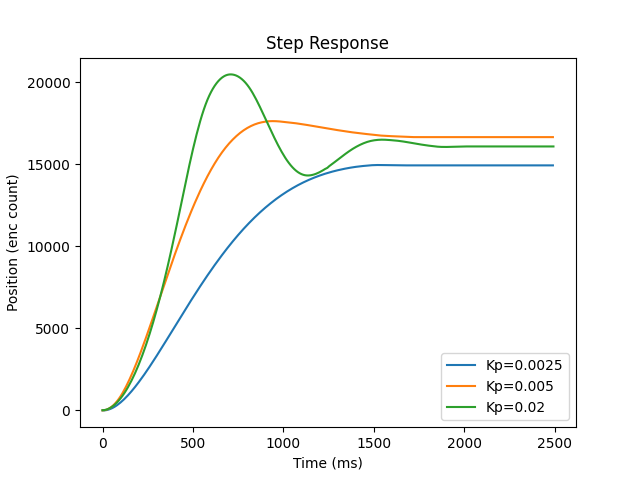

# Lab 2
For this lab, our team used a bog-standard P-controller to implement closed-loop 
control over a motor's position. Feedback is achieved using an encoder attached
to the rear of the motor with a 16k/rev resolution. The controller directly 
controls the motor with PWM fed through an H-Bridge, enabling bi-directional 
drive.

To gather step responses, we used a second python script - ran on a connected
computer - to initiate and plot three consecutive runs. The script directly
connects through the micropython REPL to avoid having to use multiple USB
cables (none of our PCs have more than one USB-A... ).

Program synchronization is accomplished using a series of prompts with 
associated checkpoints, which notify the driver program on the
connected PC when the board is ready to accept specific inputs. This also
works to filter out all the garbage from the micropython REPL. Data
transfer is done using a CSV format, which is streamed over the REPL.

# Response
\
Response curves for three step response

Note that as Kp increases, the overshoot of the system also does. Furthermore,
steady-state error is different between each Kp.